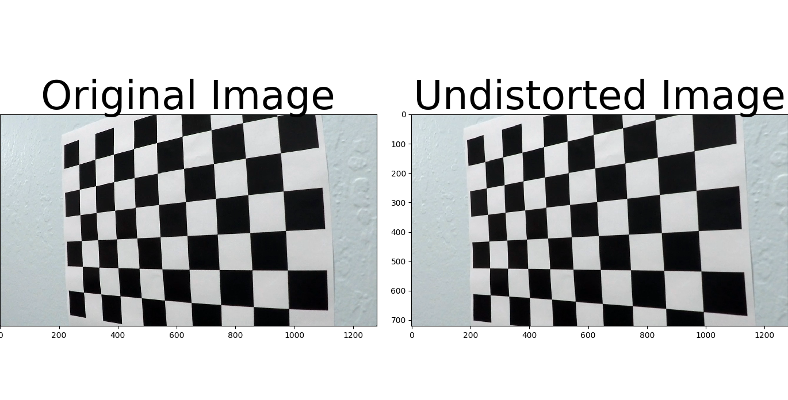
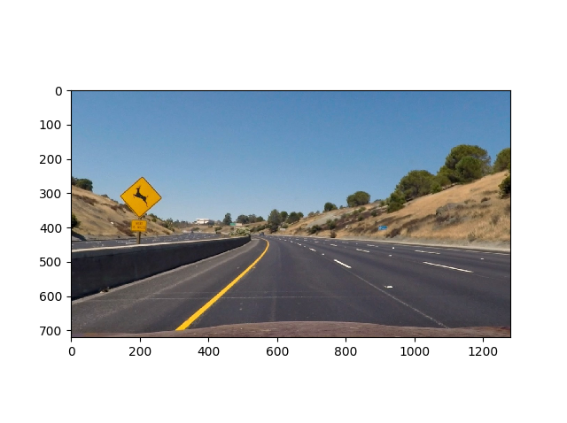
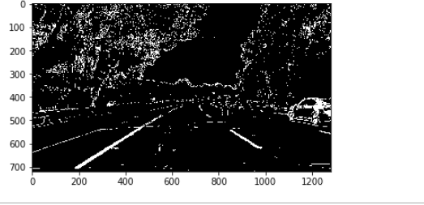
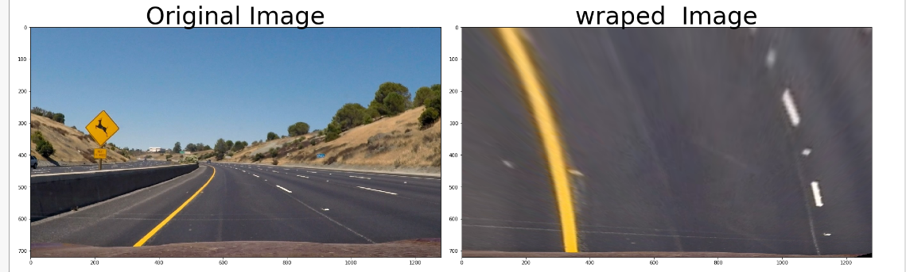
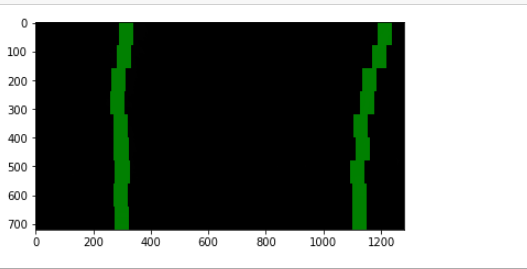
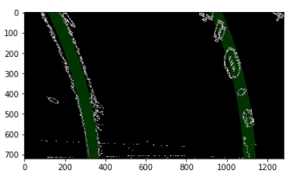
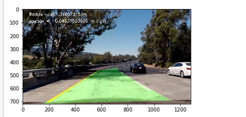

# Advanced-Lane-Lines
Self Driving Car Advanced Lane Lines Project


# The goals of this project are the following:
- Compute the camera calibration and distortion coefficients on  chessboard images.
- Apply a distortion correction.
- creat binary image that help me in finding lane lines
- Apply a perspective transform 
- detect lane lines
- Determine the curvature of the lane and vehicle position with respect to center.
- output the original images with detected lane lines
- output videos with the detected lane lines and  lane curvature and vehicle position.

# 1- Camera Calibration

I used Calibration method to detect any distortion and correct it to. I made Calibration on 20 chessboard images I used cv2.findChessboardCorners() function (code cell number 1) to detect corners on each image then I get some coefficients  using cv2.calibrateCamera() function and I used this coefficients to correct distortion using cv2.undistort() function this found in code cell number 2.


```python
from IPython.core.display import Image
Image(filename=('test_images/dis_and_undis_images.png'))
```





here is an exmple of undistorted image 


```python
from IPython.core.display import Image
Image(filename=('test_images/test2_undistorted.png'))
```





# 2- Combining Thresholds


I used a combination of color and gradient thresholds to generate a binary image in image_process() function for single images (in code cell number 6) and video_process() function for videos (in code cell number 5)   where I used  sobelx, s_channel ,magnitude binary ,diretion ,binary and l_channel.


```python
from IPython.core.display import Image
Image(filename=('test_images/last/gradient.png'))
```





# 3- perspective transform

I made perspective transform by corners_unwarp() function (in code cell number 4) takes image and return image with destination points which I determined.
x=325,y=0
Source       Destination
550,470      325-x,0
190,720      190+y,720
1130,720-25  1130+y,720
720-y,445    940+x,0


```python
from IPython.core.display import Image
Image(filename=('test_images/last/perspective transform.png'))
```





# 4- windows sliding search

I used Sliding Window Search to find lane lines using find_window_centroids() function (in code cell number 7).this function find the lane lines and I visualize it output and there is exmaple below. I fit my lane lines with a 2nd order polynomial in the road_lines() function (in code cell number 8).


```python
from IPython.core.display import Image
Image(filename=('test_images/last/slide_window.png'))
```





# 5- Curvature and Position

I calculated the raduis and the position of the vecile with respect to center between two lane lines and I implement the code in
the road_lines() function (in code cell number 8).


```python

from IPython.core.display import Image
Image(filename=('test_images/last/Curvature.png'))
```





# 6- Final Result


```python

from IPython.core.display import Image
Image(filename=('test_images/last 2/5.png'))
```





# Discussion

I think the most important thing to tune to increase the efficiency of this project is the binary image used.the idea of combinning threhold is very useful.I think the perspective transform is also good parameter to tune

the most difficult thing in the project is to search lane lines using windows, polyfit the lane line  and computing the raduis.
I think if we organise the parameters for most important to least important this will help to know the most effective thing to 
tune.


I think my code has will face problems if there are alot of cars or the sun light is very high or the intensity of the lanes are 
low. 

to make some improvments we should use more parameters and combined it with other gradients or we could use diffrent gradients 
combinations according to day morning or night or raining
